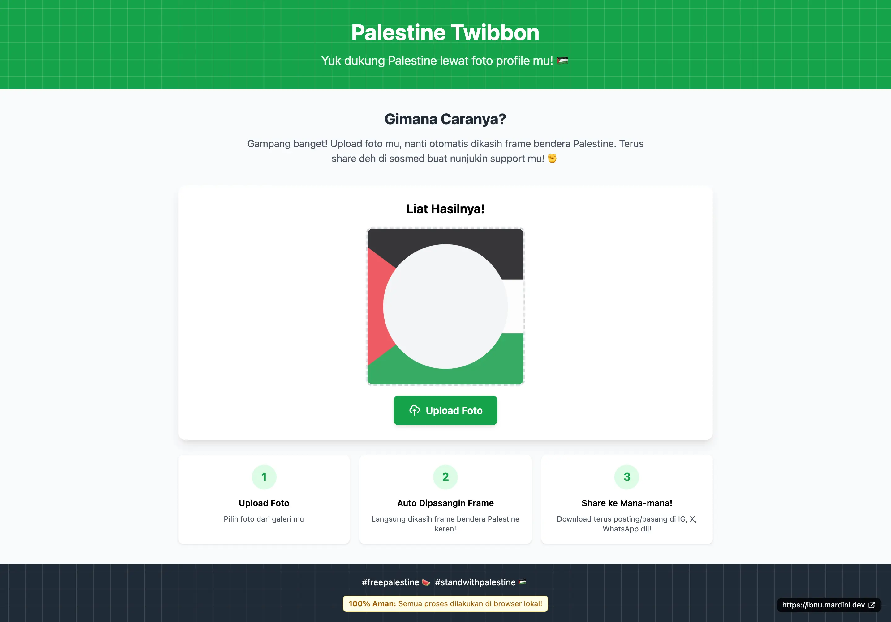

# Palestine Twibbon

[](https://github.com/Safouene1/support-palestine-banner/Markdown-pages/Support.md)

A React-based web application for creating Palestine solidarity twibbons (profile picture frames).



## Features

- Upload and customize profile pictures
- Add Palestine flag overlay/frame
- Automatic frame positioning
- Download results for social media sharing
- Mobile-friendly responsive design

## Tech Stack

- **React** 18.2.0
- **Vite** - Build tool
- **Tailwind CSS** - Styling
- **ESLint** - Code linting
- **Prettier** - Code formatting

## Getting Started

### Prerequisites

- Node.js (recommended version 16+)
- npm or yarn

### Installation

1. Clone the repository

    ```bash
    git clone https://github.com/ibnumardini/palestine-twibbon
    cd palestine-twibbon
    ```

2. Install dependencies

    ```bash
    npm install
    ```

3. Start the development server

    ```bash
    npm run dev
    ```

4. Open your browser and navigate to `http://localhost:5173`

## How to Use

1. **Upload Foto** - Choose your profile picture from your device
2. **Auto Dipasangin Frame** - The Palestine flag frame will be automatically applied
3. **Share ke Mana-mana!** - Download and share on social media platforms

## Available Scripts

- `npm run dev` - Start development server
- `npm run build` - Build for production
- `npm run lint` - Run ESLint
- `npm run lint:fix` - Fix ESLint issues automatically
- `npm run format` - Format code with Prettier

## License

Apache-2.0

## Author

Muhammad Fatkurozi <hi@mardini.dev>
